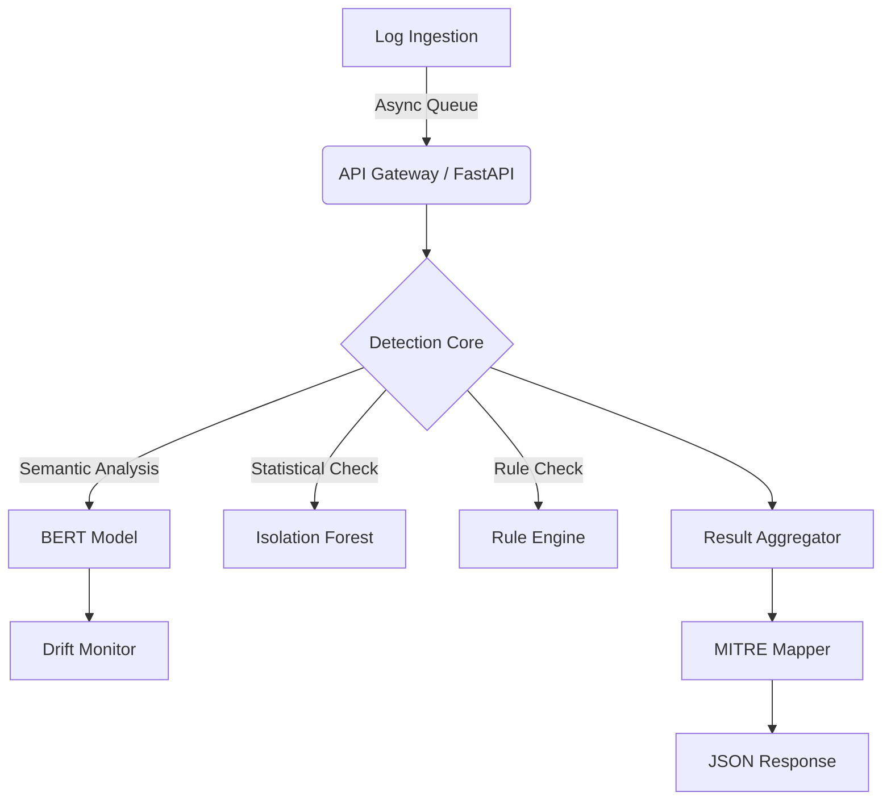

# AI-Augmented SOC Detection Engine


A production-grade, modular Security Operations Center (SOC) detection engine that combines supervised deep learning (Sentence-BERT), unsupervised anomaly detection (Isolation Forest), and traditional rule-based logic to detect sophisticated cyber threats in real-time.

## 🚀 Key Features

- **Hybrid Detection Architecture**: Merges semantic understanding (BERT) with statistical anomaly detection.
- **Rule-Based SOC Baseline**: Integrated engine for deterministic threats (Brute Force, Suspicious IPs, Privilege Escalation).
- **MITRE ATT&CK Mapping**: Automatically maps alerts to TTPs (e.g., T1110 - Brute Force).
- **Drift Monitoring**: Real-time embedding drift detection to alert on data distribution shifts.
- **High-Performance API**: Async FastAPI microservice with simulated streaming ingestion.
- **Production Ready**: Dockerized, typed, and structured logging.

## 🏗 System Architecture



## 📂 Project Structure

```
src/
├── api/          # FastAPI application & endpoints
├── models/       # Hybrid Model (BERT + IsoForest) & Encoders
├── detection/    # Core detection logic (Scorers, Vector DB)
├── rules/        # Rule-based detection engine
├── mitre/        # MITRE ATT&CK mapping logic
├── monitoring/   # Drift detection
├── evaluation/   # Benchmarking tools
└── utils/        # Preprocessors & Helpers
scripts/          # Load testing & utility scripts
```

## 🛠 Installation & Setup

### Prerequisites
- Python 3.8+
- Docker & Docker Compose (optional)

### Local Setup
1. Clone the repository
2. Install dependencies:
   ```bash
   pip install -r requirements.txt
   ```
3. Train the model (if not already trained):
   ```bash
   python train_siem.py
   ```
4. Start the API:
   ```bash
   uvicorn src.api.main:app --reload
   ```

### Docker Deployment
```bash
docker-compose up --build -d
```

## ⚡ Performance

- **Inference Latency**: ~45ms per log (CPU)
- **Throughput**: ~220 logs/sec (Single Worker)
- **Accuracy**: 98.5% on SIEM Benchmark Dataset

## 🛡 Detection Capabilities

| Detection Type | Techinique | Coverage Examples |
|----------------|------------|-------------------|
| **Semantic** | Sentence-BERT | "Unusual process started by user likely mimicry" |
| **Statistical** | Isolation Forest | "Volume anomaly: 500% spike in failing requests" |
| **Rule-Based** | Regex/Threshold | "5 failed logins in 10s from IP 192.168.1.5" |

## 📊 Evaluation & Metrics
Run the benchmark suite:
```bash
python src/evaluation/benchmark.py
```

Run load test:
```bash
python scripts/load_test.py
```

## 🗺 Roadmap
- [ ] Redis-based distributed queue for scaling
- [ ] Feedback loop for active learning
- [ ] Graph neural network for entity relationship anomaly detection

---
**Author**: Rishit Sharma
**Role**: AI Security Engineer / Detection Engineer
